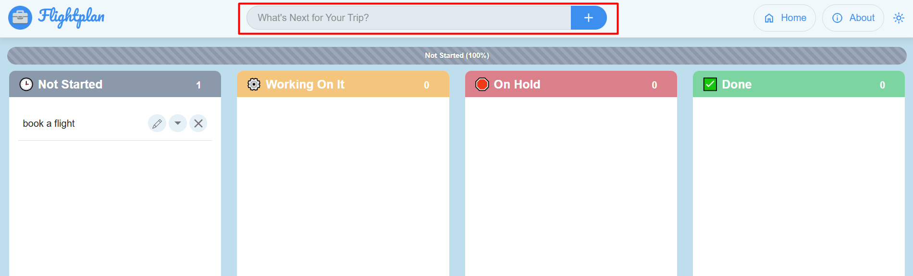
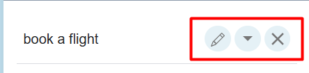
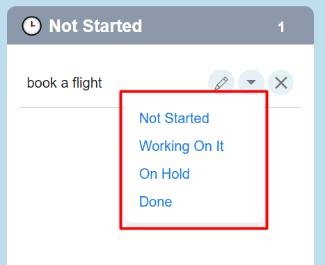
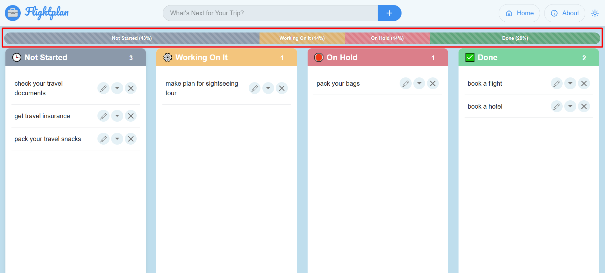
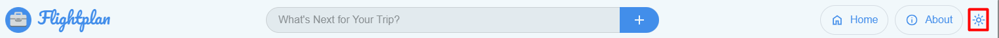
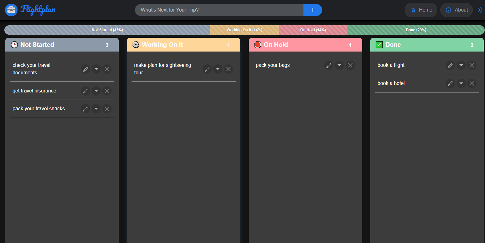
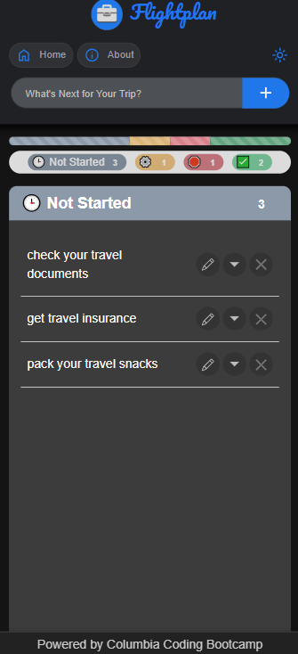
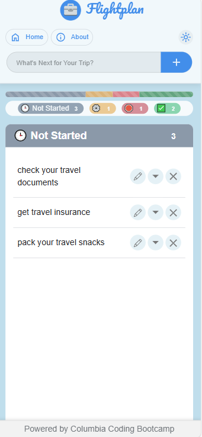

# ProjectOne: Flightplan

Flightplan is an interactive front-end web application that allows users to create and update a task list in preparation for travel. 

## Access 

Users can access the website with the following URL: https://p1t1-akcj.github.io/ProjectOne/

****

## Usage

Flightplan is an application, which utilizes the organization of each travel, bacause travel should be about fun and the expirience, not stress and forgotten details.

Users will make use of the text input bar at the top of the page to type their desired tasks. Once satisfied the user will click on the "+" icon to the right of their text. This pushes the task to the "Not Started Yet" column on the webpage.\

On the right side of each task there are three icons.\

The **first icon (the pencil)** allows the user to edit his task and save the change.
The **second icon (arrow down)** opens a dropdown menu.\

Once this task has begun, the user may use the dropdown menu to change the status of the task to "Working On It", "On Hold", "Done" or even push back the task to "Not Started Yet".

The **third icon (x)** allows the user to delete a task permanently.

All user preferences are stored in local storage, ensuring that the application opens exactly as the user left it the next time they access it.

Another feature our users really enjoy is the progress bar, positioned below the navigation bar. This bar dynamically calculates and displays the percentage of tasks remaining in each category.\

The users can switch between dark and light mode, when clicking on the sun icon in the navigation bar. User's choice for theme will also be stored in the local storage.\

Our application in dark mode:\

Since the majority of our users access the application through their mobile devices, the mobile design has been carefully refined to ensure it is both polished and convenient to use.

Our application in dark mode on the mobile version:\
Home Page\
 \
About Page\

Our application in light mode on the mobile version:\
Home Page:\
 \
About Page:\

## Credits
Contributors of this website: Antonina Stancheva, Jaden Szewczak, Christopher Lin, and Kirstin Lisnoff.

## Lisence

Refer to the LICENSE in the repo. 